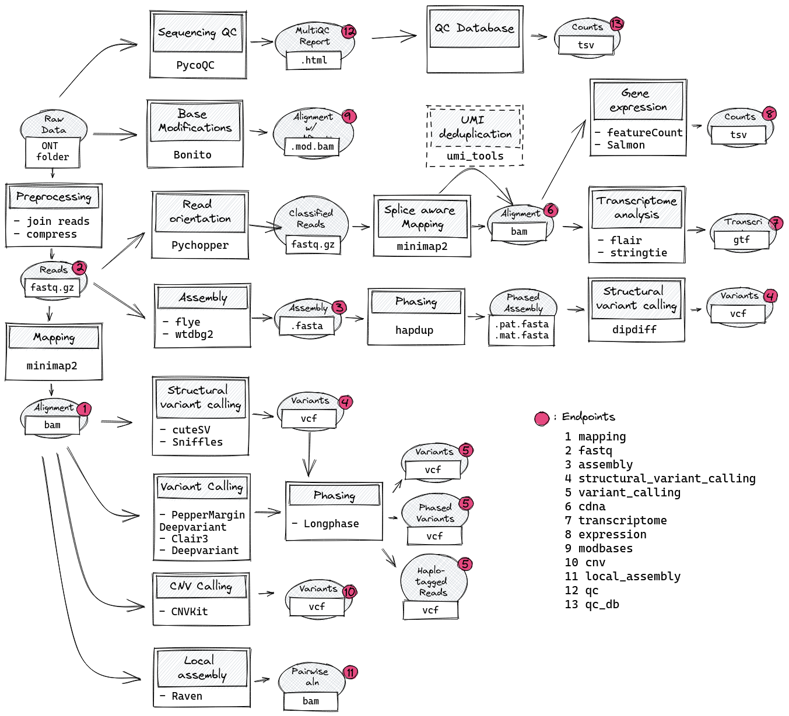

# Analysis pipeline for ONT long read data

This is a Snakemake pipeline for comprehensive analysis of longread sequencing data. It is mainly intented for research and method establishment at the Institute of medicinal genetics and applied genomics (IMGAG) of UKT Tübingen but can be adapted easily to fit your requirements.

## Overview



## Analyses

## Installation

Dependencies:

- Snakemake (`pip install snakemake`)
- Conda
- Docker/Singularity for Variant Calling with _Pepper-Margin-Deepvariant_

For cDNA (Transcriptome) analysis you need to manually install the following tool and adjust the application paths in the config file:

- [SQANTI3](https://github.com/ConesaLab/SQANTI3)

All other required tools will be installed into generated Conda environments.

## Configuration

All configuration takes place in a config file (`config.yml`) located in the work directory. Look into the default settings (`config/config_defaults`) for a list of options. Most important is to to change the path to the genome reference and select required analysis steps.

The pipeline should be run in an analysis folder that will contain final and intermediate results. The location of the raw data is defined by the `sample_run_table.tsv`  placed in the working dir. In the simplest form this is a two-column tab separated textfile containing sample names and data folder:

```raw
sample1
sample1
sample2
```

For more config options look into the [input configuration](doc/data_input.md).

## Run the pipeline

Assuming you are in the working directory which contains a `config.yml` and a `sample_run_table.tsv` run the pipeline with:

```raw
snakemake --use-conda -s /path_to_repo/ont_tools/workflow/Snakefile
```
