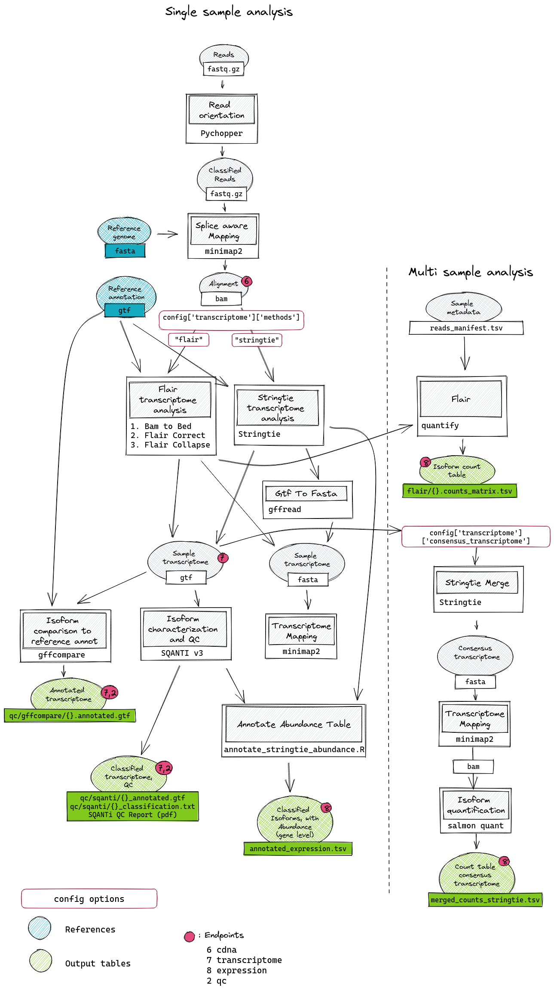

Transcriptome (cDNA) Analysis
=============================

### Pipeline overview

 

There are three different endpoints for individual parts of the cDNA analysis which should defined as steps in the config file:

1) `cdna`: This step only runs the read classification with pychopper and splice aware mapping
2) `transcriptome`: This step runs the isoform analysis with `stringtie` or `flair` or both, depending on the config option `transcriptome.methods` . When additionally, the `qc` step is defined, a detailed classification report of the transcripts is generated with SQANTI3. Additionally a comparison to the reference annotation is created with `gffcompare`
3) `expression`: Expression tables are created on multiple levels. `Featurecount` is used to create a gene expression table for each sample. If additionally, the step `transcriptome` is selected, the `flair quantify` module is used to create an count matrix containing all samples defined in the metadata file `reads_manifest.tsv` with reference to the transcriptome generated by `flair` for each individual sample. When the `stringtie` method is selected, in a first step, a consensus transcriptome is generated with `stringtie merge` which is then used as reference for quantification of all samples using `salmon quant`. The joined count table is available in `isoform_counts/merged_counts_stringtie.tsv`
